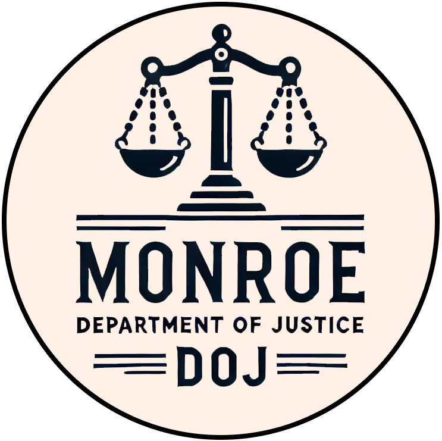

  
  <h1><strong>State of Monroe Prosecutor's Guidelines</strong></h1>

---

These guidelines are established to assist prosecutors or lawmen of the State of Monroe in their duties as prosecutors when representing the State in criminal proceedings. This document shall serve as a practical guide for the preparation and presentation of cases before the General Court.

---

  <h2><strong>Article I: Role of the Prosecutor</strong></h2>

### Duties and Responsibilities

1. **Primary Duties**
   - Present criminal cases on behalf of the State
   - Ensure justice is served fairly and impartially
   - Protect the rights of both victims and accused
   - Maintain the dignity of the court

2. **Ethical Obligations**
   - Present truthful evidence only
   - Disclose exculpatory evidence to the defense
   - Maintain professional conduct
   - Seek justice, not merely convictions

---

  <h2><strong>Article II: Case Preparation</strong></h2>

### Evidence Collection

1. **Types of Evidence**
   - Physical evidence (weapons, stolen goods, contraband)
   - Written documentation (reports, letters, contracts)
   - Witness statements
   - Expert testimony
   - Circumstantial evidence

2. **Evidence Handling**
   - Maintain chain of custody
   - Document all evidence carefully
   - Store evidence securely
   - Present evidence clearly and organized

### Case Building

1. **Investigation Review**
   - Read all reports thoroughly
   - Interview all witnesses
   - Review physical evidence
   - Identify potential problems

2. **Case Organization**
   - Create timeline of events
   - List all witnesses
   - Prepare evidence index
   - Draft opening statement
   - Outline closing arguments

---

  <h2><strong>Article III: Court Procedures</strong></h2>

### Opening Statement

1. **Structure**
   - State the charges
   - Preview the evidence
   - Explain what will be proven
   - Be clear and concise

2. **Example Format:**
   "Your Honor, the State will prove that on [date], the defendant [name] did willfully and unlawfully [describe crime]. We will present evidence including [list key evidence], and testimony from [key witnesses] that will establish the defendant's guilt beyond doubt."

### Witness Examination

1. **Direct Examination**
   - Ask open-ended questions
   - Let witness tell their story
   - Establish facts chronologically
   - Do not lead the witness

2. **Sample Questions:**
   - "What did you observe on [date]?"
   - "What happened next?"
   - "Can you describe the person you saw?"
   - "How certain are you of your identification?"

3. **Cross-Examination**
   - Use leading questions
   - Challenge inconsistencies
   - Question credibility if warranted
   - Maintain professional demeanor

### Evidence Presentation

1. **Physical Evidence**
   - State what the item is
   - Establish relevance
   - Demonstrate chain of custody
   - Request permission to approach witness

2. **Documentation**
   - Read relevant portions
   - Explain significance
   - Submit to court record
   - Provide copies as required

---

  <h2><strong>Article IV: Common Objections</strong></h2>

1. **Types of Objections**

   **Foundation Objections:**
   - **Lack of foundation**: When testimony is given without first establishing the witness's basis of knowledge
     * Example: Witness testifying about a document's contents without establishing they've seen or read it
   
   - **Improper foundation**: When the background information provided doesn't adequately support the evidence
     * Example: Attempting to submit a letter without proving who wrote it

   - **Lack of authentication**: When evidence hasn't been properly identified or verified
     * Example: Presenting a contract without verifying signatures

   - **No personal knowledge**: When a witness testifies about matters they didn't personally observe
     * Example: "I heard from someone that the defendant was there"

   **Question Format Objections:**
   - **Leading the witness**: Questions that suggest the desired answer
     * Example: "You saw the defendant run away, didn't you?"

   - **Compound question**: Asking multiple questions at once
     * Example: "Did you see the defendant enter the bank and pull out his gun?"

   - **Argumentative**: Challenging or arguing with the witness rather than asking questions
     * Example: "How can you expect us to believe that story?"

   - **Asked and answered**: When a question has already been asked and responded to
     * Example: Repeatedly asking the same question hoping for a different answer

   - **Badgering the witness**: Aggressive, intimidating, or harassing questioning
     * Example: Repeatedly demanding answers after witness has responded

   - **Assumes facts not in evidence**: Question includes unproven facts
     * Example: "When did you stop stealing cattle?" when theft hasn't been established

   **Evidence Objections:**
   - **Relevance**: Evidence or testimony has no bearing on the case
     * Example: Questions about unrelated past events

   - **Hearsay**: Repeating statements made by someone not present in court
     * Example: "My friend told me he saw the defendant there"

   - **Speculation**: Witness guessing or making assumptions
     * Example: "I think he probably intended to rob the store"

   - **Best evidence rule**: Using copies when originals exist and are available
     * Example: Testimony about a document's contents when the document itself is available

   - **Prejudicial value outweighs probative value**: Evidence's potential to prejudice outweighs its usefulness
     * Example: Graphic descriptions that aren't necessary to prove the case

   - **Privileged information**: Protected communications or information
     * Example: Private conversations between husband and wife

   **Procedural Objections:**
   - **Beyond the scope**: Questions outside the topics covered in direct examination
     * Example: Asking about new topics during cross-examination

   - **Improper character evidence**: Bringing up past conduct to prove current behavior
     * Example: "The defendant was arrested five years ago"

   - **Improper impeachment**: Attacking witness credibility without proper foundation
     * Example: Suggesting witness is lying without evidence

   - **Narrative response**: Witness giving long, story-like answers instead of responding to specific questions
     * Example: Witness providing extensive unnecessary details

   - **Non-responsive answer**: Witness's answer doesn't address the question asked
     * Example: Q: "Where were you?" A: "Well, let me tell you about my whole day..."

2. **Making Objections**
   - Stand when objecting
   - State objection clearly and concisely
   - Provide brief basis if needed
   - Example: "Objection, Your Honor. Hearsay."

3. **Responding to Objections**
   - Listen to complete objection
   - Wait for judge's ruling
   - If sustained:
     * Rephrase question
     * Move to different line of questioning
   - If overruled:
     * Continue with original question
     * Note objection is preserved for record

4. **Common Objection Definitions**
   - **Sustained**: Judge agrees with the objection; question must be rephrased or withdrawn
   - **Overruled**: Judge disagrees with objection; questioning may continue as is
   - **Sidebar**: Private conference with judge to discuss objection without jury or witness hearing

---

  <h2><strong>Article V: Closing Arguments</strong></h2>

### Structure

1. **Introduction**
   - Restate charges
   - Summarize evidence presented

2. **Body**
   - Connect evidence to charges
   - Address weaknesses
   - Emphasize strength of case

3. **Conclusion**
   - Request verdict
   - Thank the court

### Example Format:
"Your Honor, the State has proven beyond doubt that the defendant committed [crime]. The evidence shows [summarize key points]. Therefore, we ask the court to find the defendant guilty of all charges."

---

  <h2><strong>Article VI: Plea Negotiations</strong></h2>

### Guidelines

1. **Considerations**
   - Strength of evidence
   - Severity of crime
   - Criminal history
   - Victim's wishes
   - Public interest

2. **Authority**
   - May offer reduced charges
   - May recommend lighter sentence
   - Must have judicial approval
   - Must document all agreements

---

  <h2><strong>Article VII: Professional Conduct</strong></h2>

### Courtroom Etiquette

1. **Dress and Appearance**
   - Professional attire
   - Clean and presentable
   - Badge visible
   - Armed but secured

2. **Behavior**
   - Stand when addressing court
   - Use proper titles
   - Speak clearly
   - Show respect to all parties

### Communication

1. **With the Court**
   - "Your Honor" when addressing judge
   - Clear and professional speech
   - Truthful and direct answers
   - Proper written submissions

2. **With Defendants**
   - Professional distance
   - No personal comments
   - Clear communication
   - Document all interactions

---

  <h2><strong>Definitions</strong></h2>

### Legal Terms

- **Beyond Doubt**: The burden of proof required in criminal cases
- **Chain of Custody**: Documentation showing who had possession of evidence
- **Direct Evidence**: Evidence that directly proves a fact
- **Circumstantial Evidence**: Evidence that implies a fact
- **Exculpatory**: Evidence favorable to the defendant
- **Leading Question**: Question that suggests the answer
- **Motion**: Formal request to the court
- **Objection**: Challenge to evidence or procedure
- **Proffer**: Offer of proof to the court
- **Sustained**: Objection is upheld
- **Overruled**: Objection is denied

### Procedural Terms

- **Voir Dire**: Preliminary examination of evidence or witness
- **Foundation**: Basic facts needed to admit evidence
- **Impeachment**: Attack on witness credibility
- **Rebuttal**: Evidence contradicting other evidence
- **Sidebar**: Private conference with judge
- **Stipulation**: Fact agreed upon by both sides
